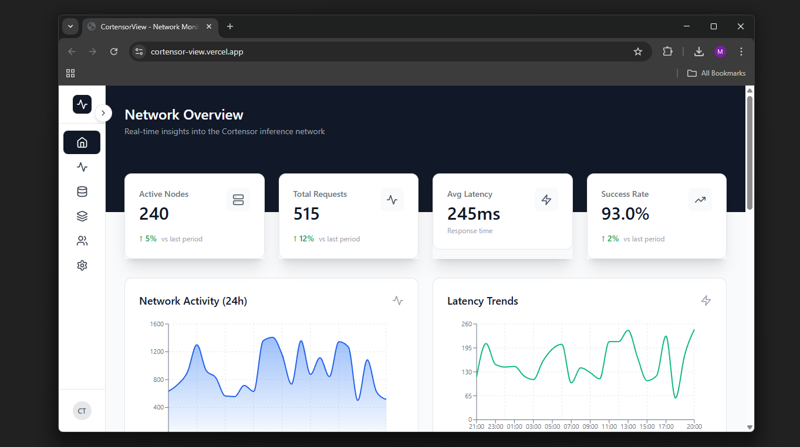

# CortensorView

A comprehensive, real-time monitoring and analytics dashboard for the Cortensor decentralized inference network. Built for Hackathon #2 to provide network operators, developers, and community members with powerful observability tools.


## Overview

CortensorView is a production-ready web application that connects directly to the Cortensor network API to provide real-time insights into network performance, node operations, inference sessions, and task analytics. This tool addresses the critical need for infrastructure observability in decentralized AI networks.

## Problem Statement

As the Cortensor network grows, operators and developers need:
- Real-time visibility into network health and performance
- Tools to monitor node operations and rankings
- Session tracking and debugging capabilities
- Task analytics and success rate monitoring
- Easy access to API endpoints for development

Without proper observability tools, it becomes difficult to optimize node performance, debug issues, or understand network behavior.

## Solution

This dashboard provides a unified interface for monitoring all aspects of the Cortensor network:

### Network Overview
- Real-time metrics for active nodes, total requests, latency, and success rates
- 24-hour activity trends with interactive charts
- Request distribution analysis
- Network health indicators

### Node Pool Management
- Complete node leaderboard with rankings
- Performance metrics and stake information
- Interactive heatmap visualization for node performance
- Filterable views for all nodes vs. node pool
- Top 10 nodes by stake analysis

### Network Statistics
- Detailed performance metrics and health indicators
- Request success vs. failure analysis
- Multi-metric performance tracking
- Throughput analysis over time
- Response time breakdown

### Session Tracking
- Search and retrieve specific cognitive sessions
- Session status overview with visual analytics
- Latency comparison across sessions
- Performance trend analysis
- Recent session history

### Task Analytics
- Real-time task monitoring
- Status distribution (completed, running, failed)
- Success rate tracking
- Performance comparison across tasks
- 24-hour execution timeline

### Developer Tools
- Interactive API Explorer
- Live endpoint testing
- Request/response inspection
- Configuration management
- Direct access to all Cortensor API endpoints

## Key Features

### Real-Time Data Integration
- Direct connection to Cortensor network API (db-be-7.cortensor.network)
- Live data updates from production endpoints
- Automatic error handling and fallback mechanisms

### Advanced Visualizations
- Line charts for trend analysis
- Bar charts for comparative metrics
- Pie charts for distribution analysis
- Area charts for multi-metric tracking
- Radar charts for performance profiling
- Interactive network topology visualization
- Performance heatmaps with color-coded rankings

### Modern User Interface
- Responsive design for desktop and mobile
- Collapsible sidebar with icon-only mode
- Smooth animations and transitions
- Dark hero sections with curved backgrounds
- Elevated metric cards with shadow effects
- Professional color scheme and typography

### Developer-Friendly
- Built with React and TypeScript
- Modular component architecture
- Recharts for data visualization
- Tailwind CSS for styling
- Easy to extend and customize

## Technical Architecture

### Frontend Stack
- React 18 with TypeScript
- Vite for fast development and building
- Tailwind CSS for styling
- Recharts for data visualization
- Lucide React for icons

### API Integration
- RESTful API client with error handling
- Type-safe data models
- Automatic retry logic
- Response caching for performance

### Data Flow
1. Components request data through centralized API service
2. API service fetches from Cortensor network endpoints
3. Data is parsed and validated using TypeScript types
4. Components render visualizations with real-time data
5. Error states handled gracefully with user feedback

## Installation and Setup

### Prerequisites
- Node.js 18 or higher
- npm or yarn package manager

### Quick Start

1. Clone the repository:
```bash
git clone https://github.com/abbasmir12/CortensorView.git
cd CortensorView
```

2. Install dependencies:
```bash
npm install
```

3. Start the development server:
```bash
npm run dev
```

4. Open your browser to:
```
http://localhost:5173
```

### Build for Production

```bash
npm run build
```

The production-ready files will be in the `dist` directory.

### Deploy

Deploy to any static hosting service:

Vercel:
```bash
npm install -g vercel
vercel
```

Netlify:
```bash
npm install -g netlify-cli
netlify deploy --prod
```

## Usage Guide

### Navigating the Dashboard

The sidebar provides access to six main sections:

1. Overview - Network-wide metrics and activity trends
2. Network - Detailed statistics and performance analysis
3. Nodes - Node pool rankings and performance heatmaps
4. Sessions - Cognitive session tracking and search
5. Tasks - Task analytics and execution monitoring
6. Config - API explorer and configuration tools

### Monitoring Network Health

The Overview tab displays key metrics:
- Active Nodes: Current number of operational nodes
- Total Requests: Cumulative inference requests
- Avg Latency: Average response time in milliseconds
- Success Rate: Percentage of successful requests

Charts show 24-hour trends for activity and latency.

### Tracking Node Performance

The Nodes tab provides:
- Complete leaderboard with rank, node ID, status, stake, and emissions
- Performance bars showing relative node efficiency
- Top 10 nodes by stake visualization
- Performance heatmap showing all node rankings
- Toggle between "All Nodes" and "Node Pool" views

### Searching Sessions

Use the Sessions tab to:
1. Enter a session number in the search box
2. Click Search or press Enter
3. View detailed session information including status, timestamp, and metrics
4. Browse recent sessions in the table below

### Analyzing Tasks

The Tasks tab shows:
- Total tasks, completed, running, and success rate metrics
- Status distribution pie chart
- Performance comparison bar chart
- 24-hour execution timeline
- Detailed task table with status badges

### Using the API Explorer

The Config tab provides:
1. Select an endpoint from the dropdown
2. Click "Send Request" to test the endpoint
3. View the JSON response in the formatted display
4. Use for development and debugging

## API Endpoints Used

The dashboard integrates with these Cortensor API endpoints:

- /network-stats - Network-wide statistics
- /leaderboard - Node rankings and performance
- /leaderboard-by-address - Node pool specific data
- /cognitive/{session_number} - Individual session data
- /network-stats-tasks - Task analytics
- /heatmap-ranks - Performance heatmap data

## Project Structure

```
CortensorView/
├── src/
│   ├── components/          # Reusable UI components
│   │   ├── charts/         # Chart components (Line, Bar, Pie, etc.)
│   │   ├── DataTable.tsx   # Data table component
│   │   ├── MetricCard.tsx  # Metric display cards
│   │   ├── NetworkTopology.tsx
│   │   ├── AdvancedHeatmap.tsx
│   │   └── Sidebar.tsx     # Navigation sidebar
│   ├── views/              # Main page components
│   │   ├── OverviewTab.tsx
│   │   ├── NetworkTab.tsx
│   │   ├── NodesTab.tsx
│   │   ├── SessionsTab.tsx
│   │   ├── TasksTab.tsx
│   │   └── ConfigTab.tsx
│   ├── services/           # API integration
│   │   └── cortensorApi.ts
│   ├── types/              # TypeScript type definitions
│   │   └── cortensor.ts
│   ├── utils/              # Utility functions
│   │   └── dataParser.ts
│   ├── App.tsx             # Main application component
│   └── main.tsx            # Application entry point
├── public/                 # Static assets
├── index.html             # HTML template
├── package.json           # Dependencies and scripts
├── tsconfig.json          # TypeScript configuration
├── vite.config.ts         # Vite configuration
└── tailwind.config.js     # Tailwind CSS configuration
```

## Hackathon Category Alignment

This project addresses multiple categories from Cortensor Hackathon #2:

### Infra Observability Tools (Primary)
Provides comprehensive monitoring and visualization for:
- Inference traffic and session load
- Node reputation and performance tracking
- Analytics for model usage and inference demand
- Real-time network health indicators

### Developer Tooling & SDKs
Includes developer-focused features:
- Interactive API Explorer for testing endpoints
- Type-safe TypeScript integration examples
- Reusable component library
- Clear code structure for extension

### Public Goods / Free Inferencing
Serves the community by:
- Providing free access to network monitoring
- Open-source codebase for community contributions
- No authentication required for basic features
- Educational resource for understanding the network

## Future Enhancements

Potential improvements for continued development:

### Advanced Analytics
- Historical data tracking and comparison
- Predictive analytics for network load
- Anomaly detection and alerting
- Custom metric dashboards

### Node Operator Features
- Personal node performance tracking
- Earnings calculator and projections
- Optimization recommendations
- Alert notifications for issues

### Developer Tools
- SDK code generator
- WebSocket support for real-time updates
- GraphQL query builder
- API rate limit monitoring

### Community Features
- Public leaderboards and competitions
- Social sharing of metrics
- Community-submitted dashboards
- Integration with Discord/Telegram bots

## Contributing

Contributions are welcome! This project is open source and maintained by the community.

### Development Workflow

1. Fork the repository
2. Create a feature branch
3. Make your changes
4. Test thoroughly
5. Submit a pull request

### Code Style

- Use TypeScript for type safety
- Follow React best practices
- Use Tailwind CSS for styling
- Keep components modular and reusable
- Add comments for complex logic

## License

MIT License - See LICENSE file for details

## Acknowledgments

Built for Cortensor Hackathon #2 to advance infrastructure observability and developer tooling in decentralized AI networks.

Special thanks to:
- Cortensor team for the robust API infrastructure
- Community members for feedback and testing
- Open source libraries that made this possible

Built with dedication for the Cortensor community. Empowering transparency and observability in decentralized AI infrastructure.
