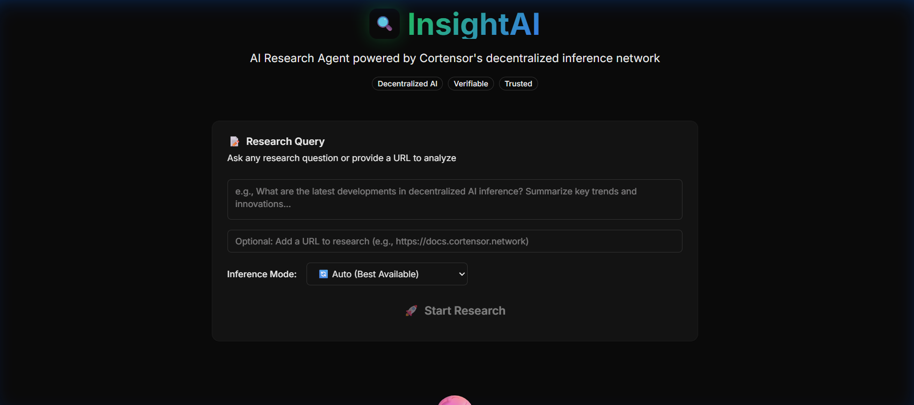
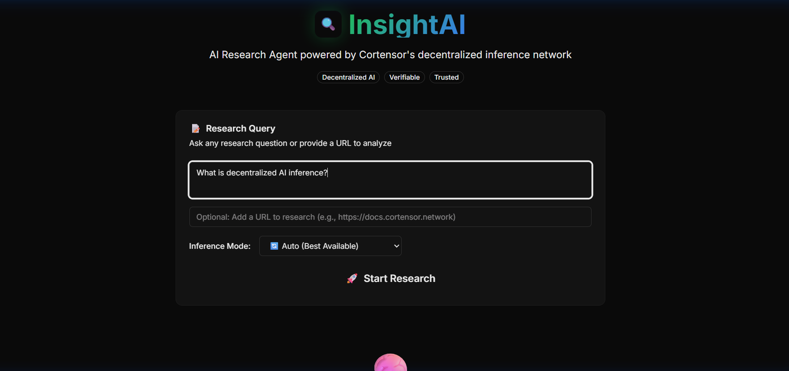
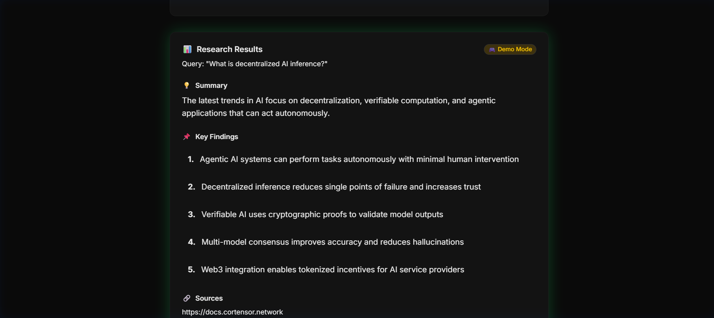

# InsightAI

> **Agentic AI Research Assistant** powered by Cortensor's decentralized inference network


---

## Table of Contents

1. [What is InsightAI](#1-what-is-insightai)
2. [Cortensor Integration](#2-cortensor-integration)
3. [Session Usage Proof](#3-session-usage-proof)
4. [Agent Specification](#4-agent-specification)
5. [Technical Architecture](#5-technical-architecture)
6. [Quick Start](#6-quick-start)
7. [User Flow](#7-user-flow)
8. [Screenshots](#8-screenshots)
9. [Links](#9-links)

---

## 1. What is InsightAI

InsightAI is a **decentralized AI research assistant** that acts autonomously to provide verified research insights. Instead of relying on a single AI provider, InsightAI leverages Cortensor's **multi-miner consensus** and **blockchain verification** for trustworthy outputs.

### Why Decentralized Research?

| Traditional AI | InsightAI + Cortensor |
|----------------|----------------------|
| Single provider = single point of failure | Distributed miners network |
| No verification of outputs | Blockchain TX verification |
| Opaque inference process | Session + Task ID transparency |
| Centralized trust | Decentralized consensus |

### Hackathon Track: Agentic Applications

InsightAI fits the **Agentic Applications** track as an autonomous research assistant that:

- Acts autonomously on user queries without step-by-step guidance
- Monitors and handles network availability with graceful fallbacks
- Produces verifiable outputs with blockchain transaction verification
- Free public access - no API keys required for end users

---

## 2. Cortensor Integration

### Features Used

| Feature | Implementation | File |
|---------|---------------|------|
| **Router Node API** | `/api/v1/completions/{sessionId}` | [`src/app/api/research/route.ts`](./src/app/api/research/route.ts) |
| **Session Management** | TestNet 0 session verification | [`src/lib/cortensor-web3.ts`](./src/lib/cortensor-web3.ts) |
| **Multi-Miner Inference** | Queries processed by decentralized nodes | [`src/app/api/research/route.ts`](./src/app/api/research/route.ts) |
| **Blockchain Verification** | TX hash via smart contract | [`src/lib/cortensor-web3.ts`](./src/lib/cortensor-web3.ts) |
| **Web3 SDK** | Direct contract interaction (ethers.js) | [`src/lib/cortensor-web3.ts`](./src/lib/cortensor-web3.ts) |


### Code Integration

From [`src/app/api/research/route.ts`](./src/app/api/research/route.ts):

```javascript
// Cortensor Router API Call
const response = await fetch(`${CORTENSOR_ROUTER_URL}/api/v1/completions/${sessionId}`, {
    method: "POST",
    headers: {
        "Authorization": `Bearer ${CORTENSOR_API_KEY}`,
        "Content-Type": "application/json",
    },
    body: JSON.stringify({
        session_id: 132,  // Cortensor TestNet 0 Session
        prompt: userQuery,
        stream: false,
        timeout: 30,
    }),
});
```

---

## 3. Session Usage Proof

InsightAI uses **Cortensor TestNet 0 Session #132**

| Proof | Link |
|-------|------|
| **Session Dashboard** | [View Session #132 on Cortensor](https://dashboard-testnet0.cortensor.network/session/132) |
| **Contract Address** | `0x2e9cC638CF07efdeC82b4beF932Ca4a8Dcd55015` (SessionV2) |
| **Network** | Arbitrum Sepolia TestNet |

> **Note**: The app includes Demo mode as a fallback when TestNet miners are unavailable, but the primary mode uses real Cortensor session inference.

---

## 4. Agent Specification

### Actions

| Action | Description | Trigger |
|--------|-------------|---------|
| `research_query` | Process natural language research questions | User enters query |
| `url_analysis` | Fetch and summarize web content | User provides URL |
| `structured_output` | Format response as summary + bullet points | Automatic |
| `verification_link` | Provide Cortensor dashboard link | On every response |

### Safety Guardrails

1. **Rate Limiting** - Prevents API abuse
2. **Input Validation** - Checks query length and content
3. **Timeout Handling** - 15-second timeout with graceful fallback
4. **No PII Storage** - No user data stored on server
5. **Demo Fallback** - Ensures availability when network down

---

## 5. Technical Architecture

```
┌─────────────────┐     ┌─────────────────┐     ┌─────────────────┐
│   InsightAI     │────▶│ Cortensor       │────▶│ Decentralized   │
│   Frontend      │     │ Router Node     │     │ Miners          │
└─────────────────┘     └─────────────────┘     └─────────────────┘
         │                       │                       │
         │                       ▼                       │
         │              ┌─────────────────┐              │
         │              │ Session #132    │              │
         │              │ LLaMA 3.1 8B    │              │
         │              └─────────────────┘              │
         │                       │                       │
         │                       ▼                       │
         └──────────────│ Blockchain TX   │◀─────────────┘
                        │ Verification    │
                        └─────────────────┘
```

### Tech Stack

| Layer | Technology |
|-------|------------|
| **Framework** | Next.js 16 (App Router + Turbopack) |
| **Styling** | Tailwind CSS v4 |
| **Components** | shadcn/ui |
| **Backend** | Cortensor Router API |
| **Blockchain** | Arbitrum Sepolia TestNet |
| **Deployment** | Vercel |
| **Web3** | ethers.js for contract interaction |

### Core Features

| Feature | Description |
|---------|-------------|
| **Research Query** | Natural language research questions |
| **URL Analysis** | Summarize content from any web page |
| **Verified Results** | Badge shows Cortensor verification status |
| **Structured Output** | Summary + bullet points format |
| **Mode Selection** | Choose Auto, Router, Web3, or Demo |
| **Demo Fallback** | Works when TestNet is unavailable |

---

## 6. Quick Start

### Prerequisites
- Node.js 18+
- npm or yarn

### Installation

```bash
# Clone the repository
git clone https://github.com/himanshu-sugha/Insightai
cd insightai

# Install dependencies
npm install

# Start development server
npm run dev
```

Open [http://localhost:3000](http://localhost:3000)

### Environment Variables

Create `.env.local`:

```env
# Cortensor Router Configuration
CORTENSOR_ROUTER_URL=http://localhost:5010
CORTENSOR_API_KEY=your-api-key-from-dashboard
CORTENSOR_SESSION_ID=132

# Web3 SDK Mode (optional)
CORTENSOR_PRIVATE_KEY=your-wallet-private-key

# Force demo mode (set to true if no router available)
USE_MOCK=false
```

### Running with Cortensor Router (Optional)

To use real Cortensor inference instead of Demo mode:

1. **Install Cortensor Router**
   ```bash
   # Follow instructions at:
   # https://github.com/cortensor/installer
   ```

2. **Create a Session**
   - Go to [TestNet 0 Dashboard](https://dashboard-testnet0.cortensor.network/session)
   - Create a new session with COR tokens
   - Note down your Session ID

3. **Start Router Node**
   ```bash
   cortensord ~/.cortensor/.env routerv1
   ```

4. **Update Environment**
   ```env
   CORTENSOR_ROUTER_URL=http://localhost:5010
   CORTENSOR_SESSION_ID=your-session-id
   ```

5. **Restart the app**
   ```bash
   npm run dev
   ```

---

## 7. User Flow

### Step 1: Enter Research Query
Visit the app and type your research question. Examples:
- "What are the latest developments in decentralized AI?"
- "Explain how proof of inference works in blockchain"
- "Summarize the benefits of multi-node AI consensus"

### Step 2: Add URL (Optional)
Paste a URL to analyze specific content:
- Documentation pages
- Blog posts
- Research articles

### Step 3: Select Inference Mode
Choose how your query gets processed:

| Mode | Description | When to Use |
|------|-------------|-------------|
| **Auto** | Automatically selects best available | Default - recommended |
| **Router API** | Uses local Cortensor router node | When running your own node |
| **Web3 SDK** | Direct smart contract interaction | For on-chain verification |
| **Demo** | Simulated responses | Testing without network |

### Step 4: Click "Start Research"
Query is processed through Cortensor's decentralized network:

```
Your Query → InsightAI API → Cortensor Router → Miners → Consensus Result
```

### Step 5: View Results
Receive research output with:
- **Summary** - Concise overview of findings
- **Key Findings** - Bullet points of important details
- **Sources** - Referenced URLs
- **Verification Badge** - Proof of decentralized processing

### Step 6: Verify on Blockchain
Click "View on Cortensor Dashboard" to see:
- Session ID
- Task ID
- Transaction hash
- Miner participation details

---

## 8. Screenshots

### Landing Page


### Research Query


### Results


---

## 9. Links

- **Live Demo**: [https://insightai-chi.vercel.app](https://insightai-chi.vercel.app)
- **GitHub**: [https://github.com/himanshu-sugha/Insightai](https://github.com/himanshu-sugha/Insightai)
- **Community PR**: [cortensor/community-projects #78](https://github.com/cortensor/community-projects/pull/78)
- **Cortensor Docs**: [https://docs.cortensor.network](https://docs.cortensor.network)

---

## Transparency Notes

- **Centralized Components**: Vercel hosting, Next.js server functions
- **No Paid Services**: Uses only Cortensor TestNet (free) and Vercel free tier
- **Data Sources**: User-provided queries, public URLs only

---

## License

MIT License - see [LICENSE](LICENSE) file.

---

**Built for Cortensor Hackathon #3**
