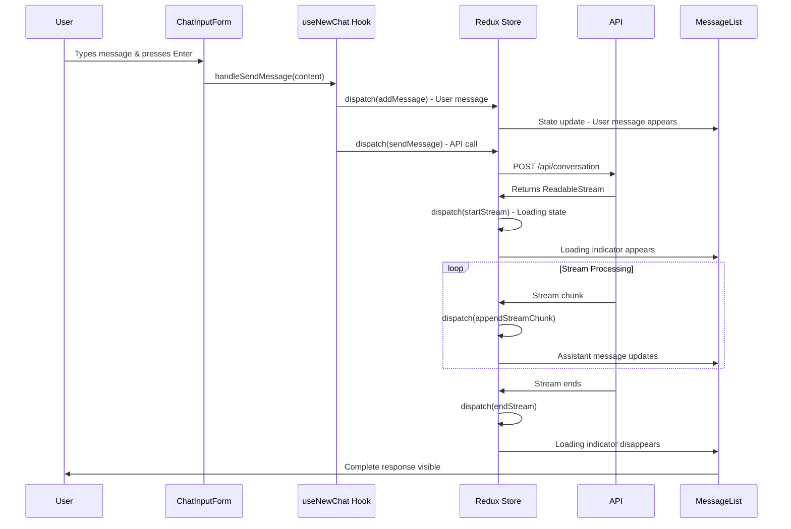

# Cortensor Chatbot - Data Flow & Architecture Guide

## Overview
This document traces the complete data flow through the new Redux-based architecture, showing how data moves from user actions to API calls to state updates.

## 1. Application Bootstrap Flow

### Startup Sequence
```
App Launch
    ↓
RootLayout renders
    ↓
AppProviders wraps entire app
    ├── ErrorBoundary (catches all errors)
    ├── Redux Provider (provides store)
    └── ServiceProvider (provides DI container)
    ↓
Main ChatPage component renders
    ↓
useNewChat() hook initializes
    ├── Dispatches initializeUser()
    ├── Dispatches loadConfigurations()
    └── Sets up all event listeners
```

### Code Flow - App Bootstrap
```typescript
// 1. RootLayout wraps with providers
<AppProviders>  // src/providers/AppProviders.tsx
  <ErrorBoundary>
    <Provider store={store}>  // Redux store
      <ServiceProvider>  // DI container
        {children}  // Main app
      </ServiceProvider>
    </Provider>
  </ErrorBoundary>
</AppProviders>

// 2. Main page initializes
function ChatPage() {
  const chatHook = useNewChat();  // src/hooks/useNewChat.ts
  
  // Auto-dispatches on mount:
  useEffect(() => {
    dispatch(initializeUser());      // Load/create user ID
    dispatch(loadConfigurations());  // Load models, domains, personas
  }, []);
}
```

## 2. User Authentication & Configuration Flow

### User Initialization Flow
```
useNewChat() hook mounts
    ↓
dispatch(initializeUser()) 
    ↓ (async thunk)
userSlice.ts - initializeUser()
    ├── Check localStorage for existing user
    ├── If found: restore user data
    └── If not found: generate new UUID
    ↓
Redux state updated
    ├── user.userId = "uuid-123"
    ├── user.isConnected = false
    └── user.preferences = defaults
    ↓
useNewChat() receives updated user
    ↓
dispatch(loadChatSessions(userId))
    ↓ (async thunk)
chatSlice.ts - loadChatSessions()
    ├── Load from localStorage: `chat_sessions_${userId}`
    └── Parse JSON sessions
    ↓
Redux state updated
    └── chat.sessions = { sessionId: ChatSession }
```

### Code Flow - User & Config Loading
```typescript
// src/store/slices/userSlice.ts
export const initializeUser = createAsyncThunk(
  'user/initialize',
  async () => {
    // 1. Try to restore from localStorage
    const savedUser = localStorage.getItem('user');
    if (savedUser) return JSON.parse(savedUser);
    
    // 2. Create new user
    const userId = crypto.randomUUID();
    const userData = { userId, address: null, isConnected: false };
    localStorage.setItem('user', JSON.stringify(userData));
    return userData;
  }
);

// src/store/slices/configSlice.ts  
export const loadConfigurations = createAsyncThunk(
  'config/loadConfigurations',
  async () => {
    // 1. Import configurations
    const { AVAILABLE_MODELS } = await import('@/lib/models');
    const { DOMAIN_CONFIGS } = await import('@/lib/domains');
    
    // 2. Load saved preferences
    const savedConfig = localStorage.getItem('app_config');
    const config = savedConfig ? JSON.parse(savedConfig) : {};
    
    return {
      models: AVAILABLE_MODELS,
      domains: DOMAIN_CONFIGS,
      selectedModelId: config.selectedModelId || 'deepseek-r1',
      // ... other configs
    };
  }
);
```

## 3. Chat Session Management Flow

### Creating New Chat Session
```
User clicks "New Chat" button
    ↓
handleNewChat() called
    ↓
dispatch(createSession({ id, name }))
    ↓
chatSlice.ts - createSession reducer
    ├── Add new session to state.sessions[id]
    ├── Set as currentSessionId
    └── Initialize with empty messages array
    ↓
Component re-renders with new session
    ↓
Auto-save triggered (useEffect)
    ↓
dispatch(saveChatSessions())
    ↓
localStorage updated
```

### Code Flow - Session Creation
```typescript
// src/hooks/useNewChat.ts
const handleNewChat = useCallback(() => {
  // 1. Generate unique session ID
  const sessionId = crypto.randomUUID();
  const sessionName = `Chat ${allSessions.length + 1}`;
  
  // 2. Dispatch Redux action
  dispatch(createSession({ id: sessionId, name: sessionName }));
  
  // 3. Close mobile sidebar
  if (window.innerWidth < 768 && isSidebarOpen) {
    dispatch(toggleSidebar());
  }
  
  return sessionId;
}, [dispatch, allSessions.length, isSidebarOpen]);

// src/store/slices/chatSlice.ts
const chatSlice = createSlice({
  name: 'chat',
  reducers: {
    createSession: (state, action) => {
      // 1. Create new session object
      state.sessions[action.payload.id] = {
        id: action.payload.id,
        name: action.payload.name,
        messages: [],
        timestamp: Date.now(),
        isLoading: false,
      };
      
      // 2. Set as current session
      state.currentSessionId = action.payload.id;
    }
  }
});
```

## 4. Message Sending & Streaming Flow

### Complete Message Flow
```
User types message and presses Enter
    ↓
handleSendMessage(content) called
    ↓
1. Add user message to Redux state
   dispatch(addMessage({ sessionId, message: userMessage }))
    ↓
2. Start API call
   dispatch(sendMessage({ sessionId, message, modelId, ... }))
    ↓
chatSlice.ts - sendMessage() async thunk
    ├── dispatch(startStream()) - Set loading state
    ├── Fetch POST /api/conversation
    ├── Get ReadableStream reader
    └── Return reader for processing
    ↓
Stream processing begins
    ├── Read stream chunks
    ├── dispatch(appendStreamChunk()) for each chunk
    └── dispatch(endStream()) when complete
    ↓
UI updates in real-time with streaming text
```

### Code Flow - Message Sending
```typescript
// src/hooks/useNewChat.ts
const handleSendMessage = useCallback(async (content: string) => {
  const sessionId = currentSession?.id || handleNewChat();
  
  // 1. Add user message immediately
  const userMessage = {
    id: crypto.randomUUID(),
    role: 'user' as const,
    content,
    timestamp: Date.now(),
  };
  dispatch(addMessage({ sessionId, message: userMessage }));
  
  // 2. Send to API
  await dispatch(sendMessage({
    sessionId,
    message: content,
    modelId: currentModel?.id || 'deepseek-r1',
    domainId: currentDomain?.id,
    persona: currentPersona?.description,
  }));
}, [currentSession, currentModel, dispatch]);

// src/store/slices/chatSlice.ts
export const sendMessage = createAsyncThunk(
  'chat/sendMessage',
  async (params, { dispatch }) => {
    // 1. Start loading state
    dispatch(startStream({ sessionId: params.sessionId }));
    
    // 2. Call API
    const response = await fetch('/api/conversation', {
      method: 'POST',
      body: JSON.stringify({
        messages: sessionMessages,
        modelId: params.modelId,
        // ... other params
      }),
    });
    
    // 3. Return stream reader
    return response.body?.getReader();
  }
);
```

## 5. Stream Processing Flow

### Stream Data Flow
```
API returns ReadableStream
    ↓
sendMessage thunk gets reader
    ↓
Stream processing loop starts
    ├── reader.read() gets chunk
    ├── Decode chunk to text
    ├── dispatch(appendStreamChunk({ sessionId, chunk }))
    ├── Redux updates message content
    ├── Component re-renders with new text
    └── Loop continues until done
    ↓
Stream ends
    ├── dispatch(endStream({ sessionId, finalContent }))
    ├── Clean up stream state
    └── Set session.isLoading = false
```

### Code Flow - Stream Processing
```typescript
// src/store/slices/chatSlice.ts
const chatSlice = createSlice({
  reducers: {
    startStream: (state, action) => {
      const { sessionId } = action.payload;
      
      // 1. Initialize stream state
      state.activeStreams[sessionId] = {
        buffer: '',
        isStreaming: true,
        startTime: Date.now(),
        chunks: [],
      };
      
      // 2. Set session loading
      if (state.sessions[sessionId]) {
        state.sessions[sessionId].isLoading = true;
      }
    },
    
    appendStreamChunk: (state, action) => {
      const { sessionId, chunk } = action.payload;
      const stream = state.activeStreams[sessionId];
      
      if (stream) {
        // 1. Append to buffer
        stream.buffer += chunk;
        stream.chunks.push(chunk);
        
        // 2. Update last message in real-time
        const session = state.sessions[sessionId];
        if (session) {
          const lastMessage = session.messages[session.messages.length - 1];
          if (lastMessage && lastMessage.role === 'assistant') {
            lastMessage.content = stream.buffer;
          }
        }
      }
    },
    
    endStream: (state, action) => {
      const { sessionId, finalContent } = action.payload;
      
      // 1. Update final message
      const session = state.sessions[sessionId];
      if (session) {
        const lastMessage = session.messages[session.messages.length - 1];
        if (lastMessage && lastMessage.role === 'assistant') {
          lastMessage.content = finalContent || state.activeStreams[sessionId]?.buffer;
        }
        session.isLoading = false;
      }
      
      // 2. Cleanup stream
      delete state.activeStreams[sessionId];
    }
  }
});
```

## 6. Component Rendering Flow

### React Component Data Flow
```
Redux state changes
    ↓
useAppSelector() hooks detect changes
    ↓
Components re-render with new data
    ├── ChatHeader updates model/domain selectors
    ├── Sidebar updates session list  
    ├── MessageList updates with new messages
    └── ChatInputForm updates with research mode
    ↓
User sees updated UI immediately
```

### Code Flow - Component Updates
```typescript
// src/hooks/useNewChat.ts - Main hook used by components
export function useNewChat() {
  // 1. Select state from Redux
  const currentSession = useAppSelector(selectCurrentSession);
  const allSessions = useAppSelector(selectAllSessions);
  const isSidebarOpen = useAppSelector(selectIsSidebarOpen);
  const currentModel = useAppSelector(selectCurrentModel);
  
  // 2. Derived state
  const supportsResearch = currentModel ? modelSupportsResearch(currentModel.id) : false;
  
  // 3. Action handlers
  const handleNewChat = useCallback(() => {
    dispatch(createSession({ id: sessionId, name: sessionName }));
  }, [dispatch]);
  
  return {
    // State
    currentSession,
    allSessions,
    supportsResearch,
    // Actions  
    handleNewChat,
    handleSendMessage,
    // ... etc
  };
}

// Usage in components
function ChatPage() {
  const {
    currentSession,      // Current chat session
    allSessions,         // All chat sessions
    handleSendMessage,   // Send message function
    handleNewChat,       // Create new chat function
  } = useNewChat();
  
  // Component renders with current data
  return (
    <div>
      <Sidebar sessions={allSessions} onNewChat={handleNewChat} />
      <MessageList messages={currentSession?.messages || []} />
      <ChatInputForm onSubmit={handleSendMessage} />
    </div>
  );
}
```

## 7. Service Layer Integration Flow

### Service Usage Flow
```
Component needs to log/make HTTP call
    ↓
useLogger() or useHttpClient() hook
    ↓
useService(TYPES.Logger) gets service from DI container
    ↓
Service method called
    ├── Logger: Formats and outputs log
    ├── HttpClient: Makes HTTP request
    └── EventBus: Emits/listens to events
    ↓
Service handles the operation
```

### Code Flow - Service Integration
```typescript
// src/hooks/useServices.ts
export function useLogger() {
  // 1. Get logger from DI container
  const logger = useService<ILogger>(TYPES.Logger);
  
  // 2. Return wrapped methods
  return {
    debug: useCallback((message: string, context?: any) => {
      logger.debug(message, context);
    }, [logger]),
    
    error: useCallback((message: string, error?: Error, context?: any) => {
      logger.error(message, error, context);
    }, [logger]),
  };
}

// Usage in components
function ChatComponent() {
  const { info, error } = useLogger();
  
  const handleError = (err: Error) => {
    // Automatically formatted and sent to monitoring
    error('Chat error occurred', err, { 
      sessionId: currentSession?.id,
      userId: user.userId 
    });
  };
  
  const handleSuccess = () => {
    info('Message sent successfully', { 
      sessionId: currentSession?.id 
    });
  };
}
```

## 8. Error Handling Flow

### Error Propagation Flow
```
Error occurs anywhere in app
    ↓
ErrorBoundary catches React errors
    ├── Logs error with context
    ├── Sends to monitoring (production)  
    └── Shows fallback UI to user
    ↓
User can "Try Again" or "Refresh Page"
    ↓
ErrorBoundary resets and normal flow resumes
```

### Code Flow - Error Handling
```typescript
// src/components/ErrorBoundary.tsx
export class ErrorBoundary extends Component {
  componentDidCatch(error: Error, errorInfo: ErrorInfo) {
    // 1. Determine error type
    if (error instanceof AppError) {
      console.error('Application error:', error.toJSON());
    } else {
      console.error('Unexpected error:', error.message);
    }
    
    // 2. Send to monitoring
    if (process.env.NODE_ENV === 'production') {
      window.Sentry?.captureException(error, {
        contexts: { react: errorInfo }
      });
    }
  }
  
  render() {
    if (this.state.hasError) {
      // Show fallback UI with recovery options
      return <DefaultErrorFallback 
        error={this.state.error} 
        onReset={() => this.setState({ hasError: false })} 
      />;
    }
    return this.props.children;
  }
}

// Usage - Errors are automatically caught
function ComponentThatMightError() {
  const handleRiskyOperation = () => {
    if (someCondition) {
      throw new ValidationError('Invalid input provided');
    }
  };
  
  // Error will be caught by ErrorBoundary automatically
  return <button onClick={handleRiskyOperation}>Click me</button>;
}
```

## 9. Complete Data Flow Example

### Full Flow: User Sends Message


## 10. Key Redux State Structure

### Current State Shape
```typescript
{
  chat: {
    sessions: {
      "session-1": {
        id: "session-1",
        name: "Chat about AI",
        messages: [
          {
            id: "msg-1",
            role: "user", 
            content: "Hello",
            timestamp: 1703123456789
          },
          {
            id: "msg-2",
            role: "assistant",
            content: "Hi there! How can I help?",
            timestamp: 1703123456790
          }
        ],
        timestamp: 1703123456790,
        isLoading: false
      }
    },
    currentSessionId: "session-1",
    activeStreams: {
      "session-1": {
        buffer: "Current streaming text...",
        isStreaming: true,
        chunks: ["Hello", " there!"],
        startTime: 1703123456789
      }
    },
    ui: {
      isSidebarOpen: true,
      isResearchMode: false,
      selectedResponseIndex: {}
    },
    error: null
  },
  
  user: {
    userId: "uuid-12345",
    address: "0x1234...",
    isConnected: true,
    preferences: {
      theme: "dark",
      fontSize: "medium"
    }
  },
  
  config: {
    selectedModelId: "deepseek-r1",
    selectedDomainId: "general", 
    selectedPersonaId: "default",
    isMemoryEnabled: false,
    models: [...],
    domains: [...],
    personas: [...]
  }
}
```

This flow diagram shows exactly how data moves through your application from user interaction to UI updates, making it easy to debug and understand the system behavior.